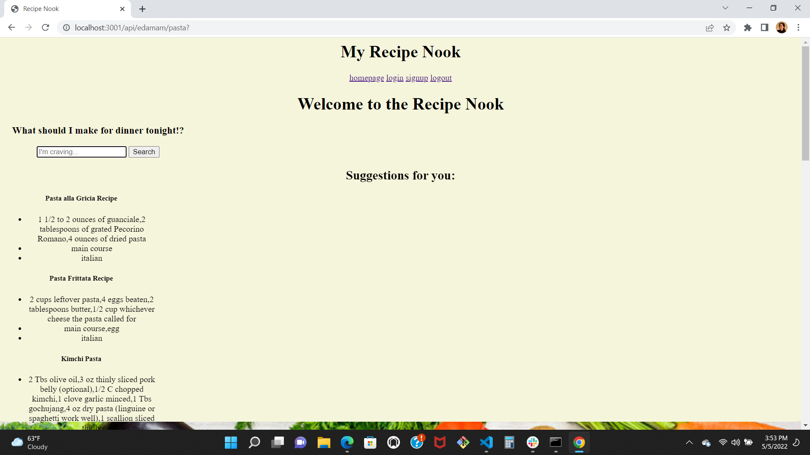

<h1 align="center">Recipe-Nook</h1>
<h1 align="center"></h1>
<h2 align="center">Technologies Used</h1>

    
    
    
    
    
    
    
    

## Table Of Contents

1. [About this Application](#about-this-application)
2. [Screen Images](#screen-images)
3. [Installation Instructions](#installation-instructions)
4. [Team Github Links](#team-github-links)

---

## About This Application

This application was developed to allow users to be able to search for a certain item of food and get in return multiple different recipes. This application has a sign-up and log-in feature when you first open up the application. After you are done signing up you are then redirected to the home page. From there you are able to type in any type of food you want and click search. Then 10 new and unique recipes will be displayed on your screen for you to choose from. 

---

## Screen Images

---

## Installation Instructions

## Team Github Links

<h2 align="center">Project Manager</h2>

Kellen Andrea

<a href="https://github.com/kellena">https://github.com/kellena</a>

<h2 align="center">Collaborators</h2>

Karen Mitchell-Clark

<a href="https://github.com/klmitchy">https://github.com/klmitchy</a>

Griffin Lundquist

<a href="https://github.com/GLundy99">https://github.com/GLundy99</a>

